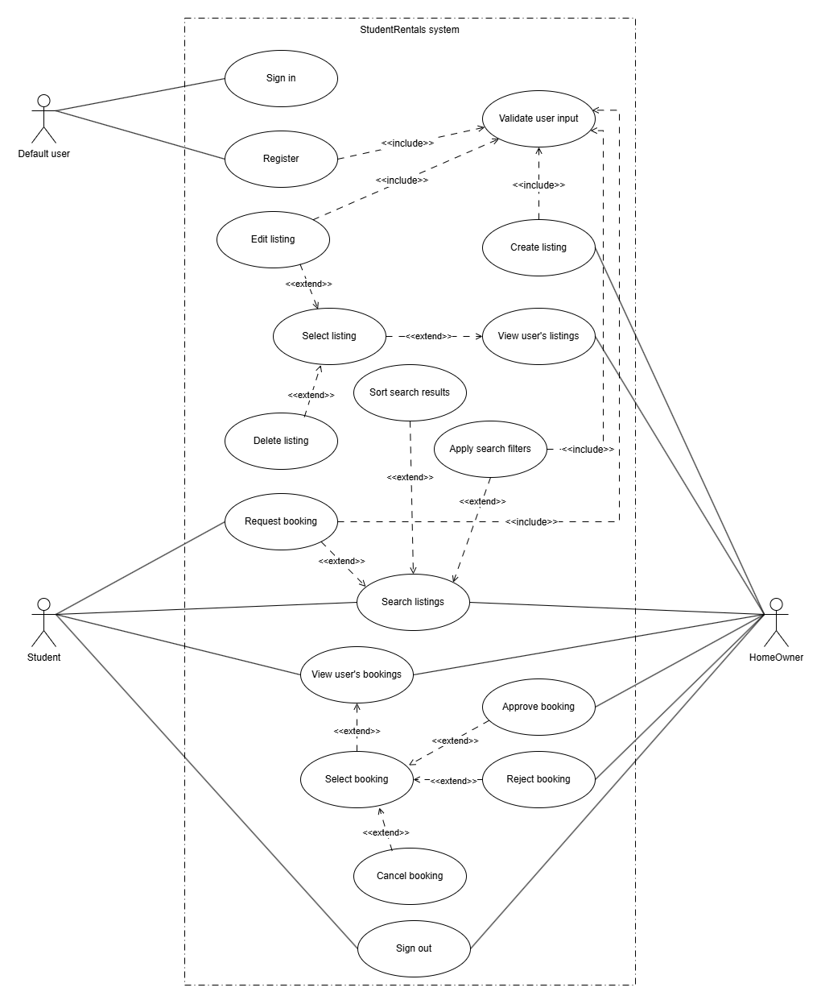
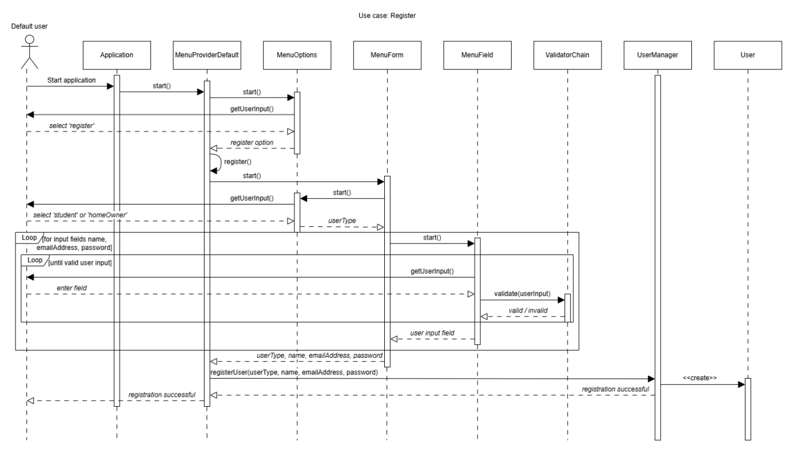
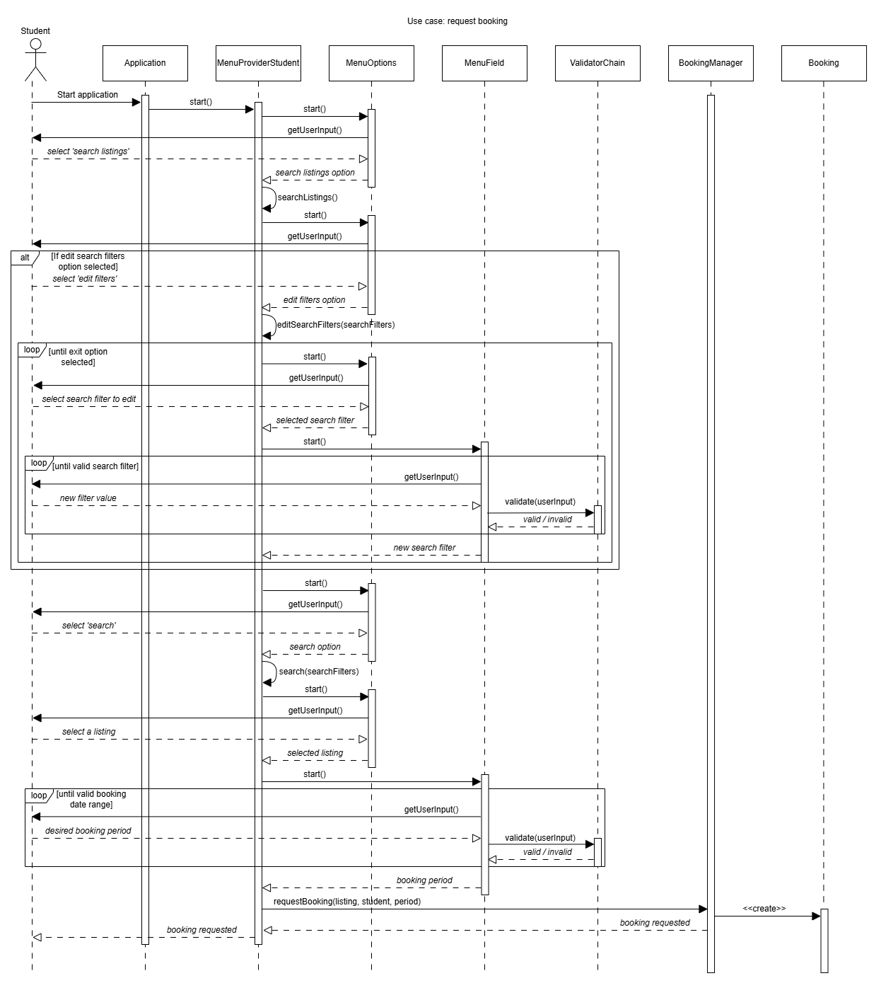
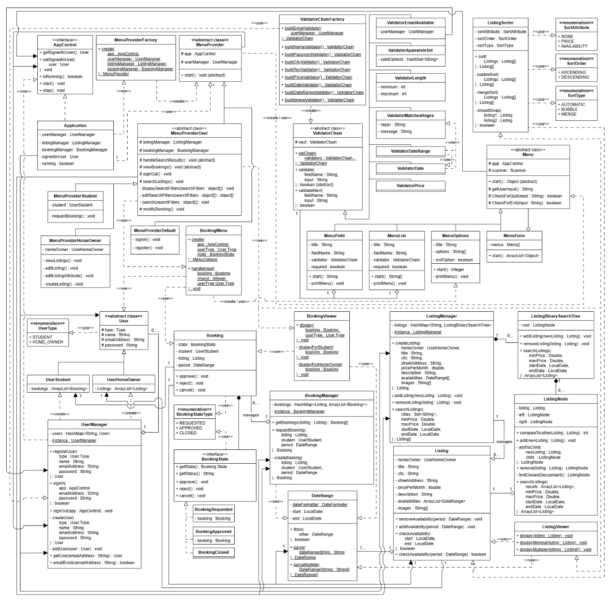

# student-rentals
This is an object oriented program for matching students with homeowners. Homeowners can post room availabilities and students can search for and book them.

This project was made as part of the assessment for my Cardiff University module Object Orientation, Algorithms and Data Structures. The following is extracted from my project report.

Functional Requirements:

    - User management:
        - New users can register for an account.
        - User accounts can be either student or home owner.
        - Users can sign into and out of an account using an email address and password.
    - Listing management:
        - Homeowners can create room listings.
        - Homeowners can edit their listings.
        - Homeowners can delete their listings.
        - Listings have attributes: Title, city, street address, price per month, description of facilities, availabilities and images.
        - All users can search for listings.
        - Searches can be filtered by city, availability and price.
        - Search results can be sorted by price or availability.
    - Booking management:
        - Students can request to book a listing. 
        - Bookings have a date range.
        - Students can cancel their booking requests.
        - Home owners can approve or reject booking requests.
        - On approval, the listing’s availabilities are updated to exclude the booking period.
        - Both users can cancel the booking once approved.
        - Once cancelled, the listings availabilities are updated again to include the booking period.
        
System Design using UML:

*Use case diagram*

*Activity diagram: register user account*

*Activity diagram: request a booking*

*Class diagram*

# Evidence and Evaluation

## Learning Outcome 1: Appreciate the main features that are needed in a programming language to support the development of reliable, portable software and how key Object Oriented (OO) principles relate to those features.

### Evaluation:
Throughout the system, I have used encapsulation, which is fundamental for maintaining integrity in large systems. Attributes such as ‘password’ in the User class are kept private, and access is enabled only through public methods like ‘validatePassword()’. This prevents unwanted changes to data by only giving access to the required functionalities, preventing corruption or misuse. Encapsulation ensures that objects remain in a valid and expected state throughout their use, which ensures reliability. 

Encapsulation also improves portability. Since the underlying data is hidden, new behaviours can be added without needing to modify existing parts of the application. For example, if a method is added to hash a password before storage and validatePassword() is modified to reflect this, existing references to validatePassword() in other classes do not need to be modified. By using encapsulation, I have ensured the program remains flexible for future expansion.

I have used inheritance to model shared behaviour between similar classes. For example, UserHomeOwner and UserStudent both inherit from User, allowing them to share attributes like ‘name’, ‘emailAddress’ and ‘password’, as well as methods like validatePassword(). Any update made to the base User class will automatically transfer to subclasses, avoiding code duplication and therefore ensuring maintainability and consistency. 

Polymorphism allows other components to interact with the abstract class User as opposed to the concrete implementations, with user-type specific behaviour being chosen dynamically. For example, the ‘MenuProviderFactory’ class returns different types of ‘MenuProvider’ depending on the concrete type of the signed-in user. Since the code calling the factory method doesn’t need to know the user’s concrete type, coupling is reduced and new user types such as administrator can easily be added. 

I have also used Java’s built-in features to keep the program robust. I have used interfaces throughout my system to enhance portability. For example, the AppControl interface provides methods for updating the application’s state, such as start() and stop(). This enables the console-based controller to be swapped out in the future with another, like a GUI-based controller, without modifying any existing code. The use of exception handling in input validator classes such as ValidatorDate ensures user inputs match the expected formats, and exceptions are caught to prevent crashes at runtime. Generics such as ‘ArrayList<Listing>’ enforce type rules and so prevent mismatching of types, leading to errors. These features demonstrate how Java itself provides mechanisms for improving reliability and maintainability. 

## Learning Outcome 2: Apply principles of good OO software design to the creation of robust, elegant, maintainable code.

### Evaluation:

To encapsulate booking behaviour, I had initially planned to keep all logic within the Booking class, with a switch statement in each method to choose behaviour for the current status. However, I soon realised that this would result in unneeded complexity and would clearly violate the single responsibility principle, as the Booking class would be responsible for managing logic for multiple states. This would also violate the open/closed principle, as any time a new state is to be added, the booking class will have to be modified.

Using the state pattern, the Booking class designates behaviour to state classes such as BookingRequested, which each implement a common BookingState interface. The booking class holds a reference to a BookingState object, allowing methods such as approve() to pass their calls to the booking’s current state. This allows the behaviour of the booking to change dynamically using polymorphism as opposed to large conditionals, improving readability.

This implementation clearly demonstrates the single responsibility principle. The booking class focuses solely on handing responsibility to its current state, and the state classes only encapsulate behaviour relevant to themselves. As methods are small and specific, they are less prone to errors, easier to understand and easier to maintain.

This also demonstrates the Liskov substitution principle, as all concrete booking states can be substituted for each other without breaking the Booking class. booking states provide different implementations of the same behaviour, ensuring that their substitution does not lead to unexpected results. 

The high-level Booking class is unaware of concrete implementations, it only relies on the abstraction BookingState, satisfying the dependency inversion principle. This results in loose coupling, allowing state behaviours to be extended without changing Booking.

The open/closed principle is satisfied as new states, such as a state to model completed bookings, can simply be added as new classes implementing BookingState without needing to modify any existing code. This reduces the risk of introducing errors when extending the system, enhancing maintainability.

This has also made the system more robust. For example, in the BookingClosed state, any attempt to approve, reject or cancel will result in an exception being thrown. By preventing invalid state transitions, errors are caught immediately instead of waiting to fail later. This clearly follows the fail-fast principle.

One limitation of this approach is that the number of classes has increased, however this trade-off is justified given the increased modularity, readability and ease of extension.

## Learning Outcome 4: Explain the difference between various fundamental algorithmic techniques and employ these for simple algorithm design.

### Evaluation:

The implementation of the sort function demonstrates a clear contrast between two widely used algorithmic techniques – iterative and divide-and-conquer – and their trade-offs for efficiency and complexity. 
Bubble sort is a very simple iterativeS sorting algorithm. It maintains a low overhead by operating over the same array that it is sorting, with only a single variable used as a temporary storage. This low overhead makes it perfect for small datasets; however, its high worst-case time complexity of O(n2) makes it inefficient for larger datasets.

On the other hand, merge sort ensures a lower worst-case time complexity of O(nlog(n)) by using a divide-and-conquer technique. It gives a far more efficient sort for larger datasets by recursively splitting an array in half, sorting those halves and merging them back together. However, the high volume of temporary arrays created during the merge phase of recursion each need additional memory, and so this contributes to a significantly higher overhead than the bubble sort.

To weigh up these trade-offs between speed and memory, I have used a common sort(listings) method in the class, which selects the appropriate algorithm for the number of listings in the dataset. A threshold of 30 listings has been given; any more than this and the bubble sort’s quadratic growth of iterations will degrade efficiency too highly, any less and the overhead of the merge sort is not worth the minimal benefits it brings compared to bubble sort. 

I have encapsulated comparison logic into the method shouldSwap(listing1, listing2), allowing both algorithms to be reused for different variations of the sort. Users can select whether to sort listings by pricePerMonth or earliest availability, in ascending or descending order. 

For sorting by availabilities, additional iteration is needed per comparison as the program needs to select the earliest available date from the list of availabilities. This introduces an additional complexity of O(k), where k is the size of the availabilities list. To optimise this, I could modify my Listing class to always store availabilities in ascending chronological order, that way the earliest availability will always be at index 0 of the list and no additional iteration is needed.

## Learning Outcome 6: Identify the most appropriate data structure and algorithm to solve a particular problem.

### Evaluation:

My choice of data structure for storing listings was driven by the functional requirement of searching for listings using a set of filters. I have partitioned listings by city using a hashmap, so that irrelevant listings can be ignored before traversal takes place, allowing efficient access based on location. For example, when searching for listings in Cardiff, listings in Bristol or London will never be examined. A HashMap is appropriate as it gives a lookup time of just O(1), improving search performance. If all listings were stored in the same group, querying for a given city would result in many unrelated listings being examined, decreasing efficiency.

Within each city, listings are stored in a binary search tree. Listings must be dynamically added, removed and searched based on selected attributes. A BST is optimal for this case as it preserves order, allowing for efficient range queries, which are essential to the listing search functionality. A listing’s pricePerMonth attribute naturally defines an ordering key. When searching, if a node’s pricePerMonth falls outside the specified price range, the entire subtree can be ignored. This means that irrelevant listings are never reached. This is significantly more efficient than examining each listing individually, which would be needed if they were stored in a simple list.

Assuming the tree is balanced, then after each comparison, the remaining space to be examined is halved. In this case, BST operations take O(log(n)) time to execute, which is a substantial improvement over a linear data structure like an ArrayList, where equivalent operations would have an average time complexity of O(n). 

The main limitation to my design is that the BSTs are not self-balancing, meaning if listings are inserted in order of price, the tree resembles a linked list and worst-case time complexity degrades to O(n). A future enhancement I could make to fix this is to use a self-balancing structure such as an AVL tree, which forces the difference in heights between left and right subtrees to be no greater than one. This ensures the tree remains balanced and traversal time consistently remains O(log(n)) for all cases. I would implement this in my ListingBinarySearchTree class by rotating nodes on insertion and deletion if the operation unbalances the tree, or simply by using Java’s built-in TreeMap structure instead.

An additional improvement I could make is to adapt the BST and node classes to use generics, as this would enable reuse of the structure for other part of the system. For example, if popular listings receive a high volume of booking requests, it would be more efficient to store them using BSTs as well, possibly ordered by booking period. 

## Learning Outcome 7: Explain and apply a range of design patterns.

### Evaluation:

In addition to the state pattern discussed earlier, the system uses several other patterns to reduce coupling and improve flexibility.

The manager classes (UserManager, ListingManager and BookingManager) each use the singleton pattern to ensure there is only one instance of the manager at once. This is appropriate as managers provide a central source of authority and storage over a single set of users, listings and bookings. All users should access the same set of listings, and bookings need access to a consistent set of listings. Allowing multiple managers to be created could lead to different parts of the system operating on different datasets, and possible corruption or runtime crashes. 

Issues that can arise from using the singleton pattern include tight coupling and hidden dependencies inside classes using the singletons. I have mitigated this by using dependency injection; instead of using the getInstance() method wherever required, the method is called only once by the client code and passed into UI classes through their constructors. 

Manager classes also use the facade pattern to provide high-level interfaces for complex subsystems. For example, the ListingManager class provides public methods for storing, deleting and searching for listings in the underlying data structure HashMap<City, ListingBST>. UI controllers such as MenuProvider interact solely with these facades and therefore do not need to know about internal implementation details. As a result, coupling is reduced and the system is made more portable, as storage implementations and algorithms can be modified without affecting classes using the facade. 

The chain of responsibility pattern is used for input validation through the abstract class ValidatorChain. Validation logic is handled by single purpose subclasses, such as validatorDate and validatorMatchesRegex. At runtime, these validators are linked dynamically using the static setChain() method. This allows for validation rules to be reordered or extended without needing to modify existing validators, enhancing portability. 

One limitation to my implementation is that validation ends at the first failure. A future improvement I could make would be to run all validators to the end of the chain and report back a full list of errors.

Additionally, I have used the strategy pattern to encapsulate different UI behaviours to separate classes according to user-type, using the abstract class MenuProvider. The Application class makes a call to the create() method inside MenuProviderFactory (an implementation of the factory pattern), which returns the correct concrete MenuProvider for the signed-in user. The client code is unaware of how a MenuProvider is chosen, avoiding large conditionals and reducing coupling. If extensions are made to the system, such as adding a new user-type, additional MenuProvider strategies can be created without needing to modify existing code, further satisfying the open/closed principle.
