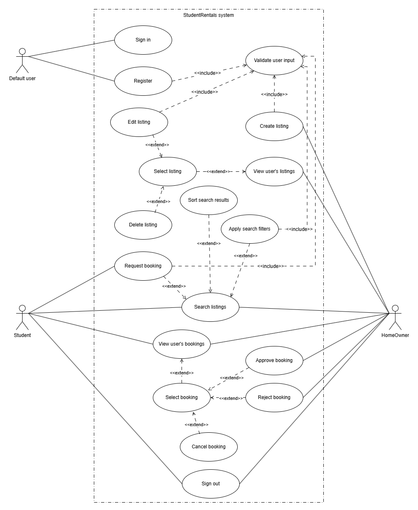
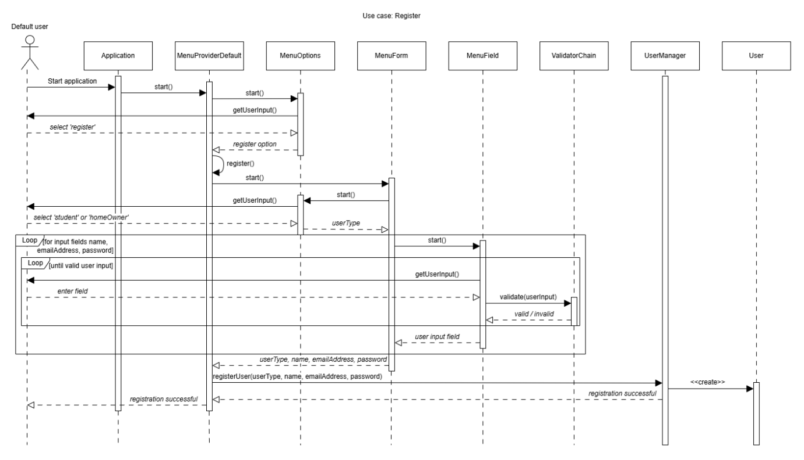
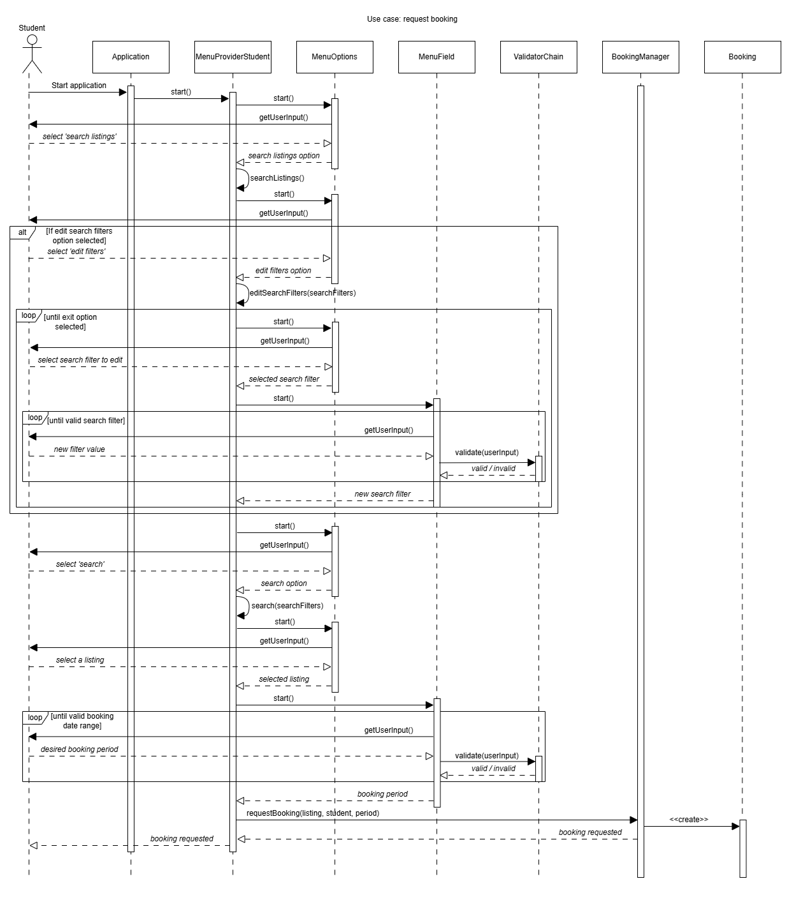
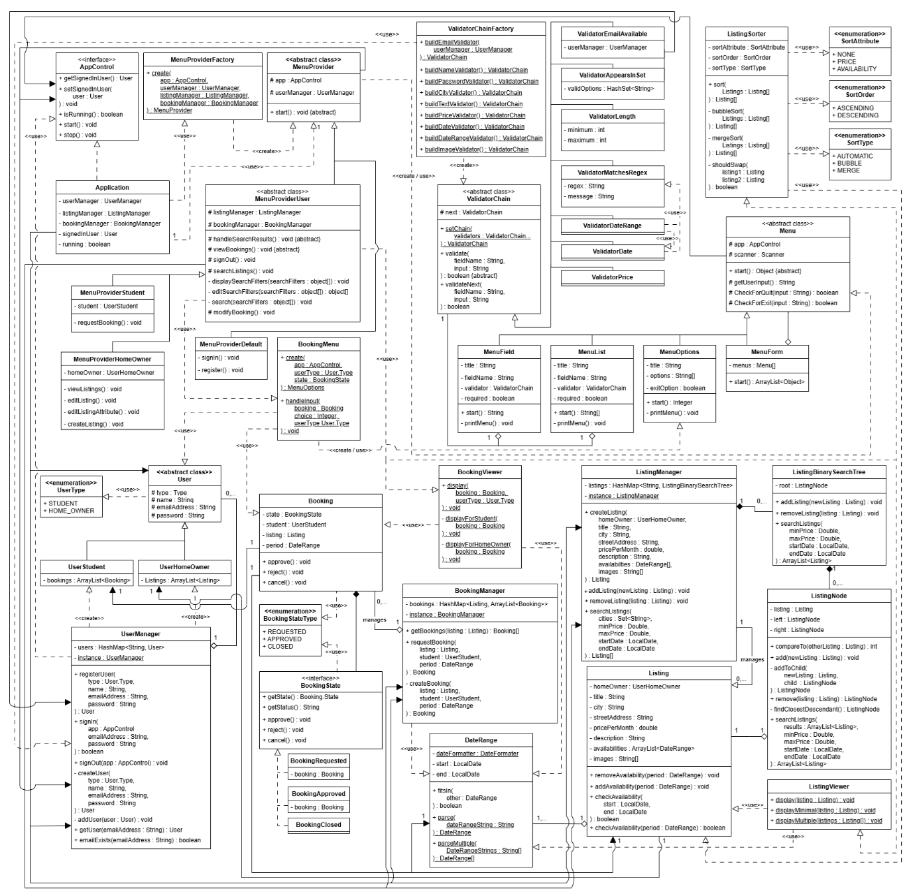

# Student Rentals

A console-based Java application that connects students with homeowners. Homeowners can post room listings and manage availability, while students can search, filter and book rooms.

Built as a coursework project for my Cardiff University module *Object Orientation, Algorithms and Data Structures*.

Written in pure Java with no external dependancies.

---

## Features

**User management**
- Register as a student or homeowner
- Sign in and out with email and password

**Listing management**
- Homeowners can create, edit and delete listings
- Listings include title, city, address, price, facilities, availability windows and images
- All users can search listings, filtered by city, availability and price
- Search results can be sorted by price or earliest availability

**Booking management**
- Students can request bookings for a date range
- Students can cancel pending requests
- Homeowners can approve or reject requests
- Either party can cancel an approved booking
- Listing availability is automatically updated on approval and cancellation

---

## Getting Started

```bash
# Clone the repo
git clone https://github.com/LeonidasPapadakis/student-rentals.git
cd student-rentals

# Compile all Java files
javac *.java

# Run the application
java Main
```

---

## System Design

### UML Diagrams

<details>
<summary>Use Case Diagram</summary>



</details>

<details>
<summary>Activity Diagram — Register User</summary>



</details>

<details>
<summary>Activity Diagram — Request a Booking</summary>



</details>

<details>
<summary>Class Diagram</summary>



</details>

---

## Design Patterns

The project applies several OOP design patterns:

| Pattern | Found in | Why |
|---|---|---|
| **State** | `Booking`, `BookingState`, `BookingRequested`, `BookingApproved`, `BookingClosed` | Manages booking lifecycle without conditionals and prevents invalid state transitions |
| **Singleton** | `UserManager`, `ListingManager`, `BookingManager` | Ensures a single authoritative data source across the application |
| **Facade** | `UserManager`, `ListingManager`, `BookingManager` | Hides internal data structure complexity from UI controllers |
| **Factory** | `MenuProviderFactory` | Returns the correct role-based menu without the caller knowing the concrete type |
| **Strategy** | `MenuProvider` and subclasses | Separates UI behaviour per user role. Extensible without modifying existing code |
| **Chain of Responsibility** | `ValidatorChain` and subclasses | Composable, reorderable input validation rules |

---

## Data Structures & Algorithms

### Listing Storage

Listings are stored in a `HashMap<City, ListingBinarySearchTree>`, combining two structures for efficient search:

- **HashMap** — O(1) lookup by city, so searches immediately ignore irrelevant locations
- **Binary Search Tree** — keyed on `pricePerMonth`, enabling efficient price-range queries by pruning entire subtrees outside the range, giving O(log n) assuming a balanced tree

**Known limitation:** the BST is not self-balancing. Inserting listings in price order degrades performance to O(n). A future improvement would be to replace it with an AVL tree or Java's built-in `TreeMap`.

### Sorting

A hybrid sort strategy is used in `ListingSorter`:

| Dataset size | Algorithm | Time complexity | Reason |
|---|---|---|---|
| ≤ 30 listings | **Bubble sort** | O(n²) | Low memory overhead, high time complexity is negligible at small scale |
| > 30 listings | **Merge sort** | O(n log n) | Better worst-case performance justifies the higher memory usage |

Comparison logic is extracted into `shouldSwap()`, making both algorithms reusable across sort modes (price and availability, ascending and descending).

---

## OOP Principles Applied

- **Encapsulation** — private fields (e.g. `password` in `User`) accessed only through controlled methods
- **Inheritance** — `UserHomeOwner` and `UserStudent` extend `User`, sharing common attributes and methods
- **Polymorphism** — components interact with abstractions (`User`, `MenuProvider`, `BookingState`) rather than concrete types
- **Interfaces** — `AppControl` decouples the console controller, making a future GUI swap possible without changing existing code
- **Dependency injection** — singletons are passed through constructors rather than called internally, reducing hidden coupling
- **SOLID principles** — each class has a focused responsibility. New states, user types and validators can be added without modifying existing code
